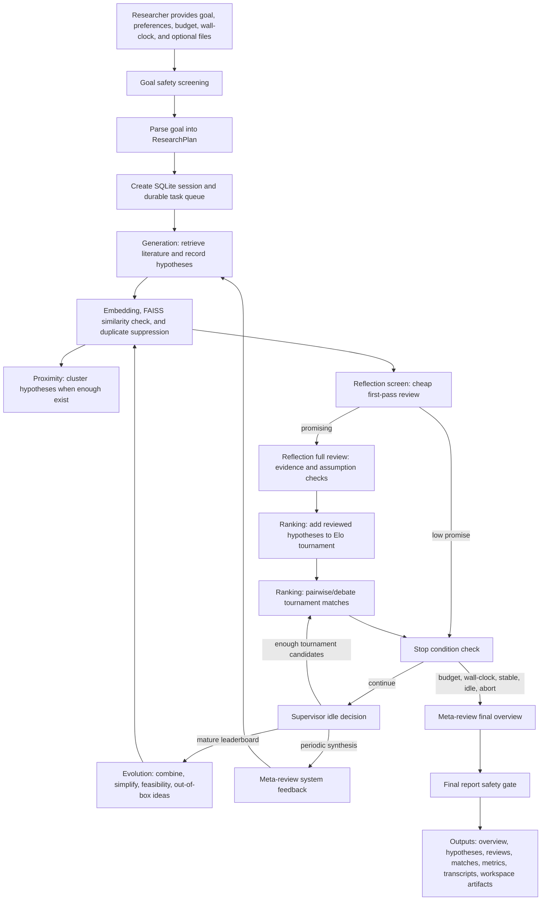

# Co-Scientist Application Manual

This manual describes how the local Co-Scientist application works, what the
research workflow does at each step, which inputs and outputs are produced, and
which options control the system. It is written for experienced scientists who
want to understand the behavior of the application before using it for
hypothesis generation, literature-grounded evaluation, experiment design, data
retrieval, analysis, and publication drafting.

The implementation is a local Python application with a Typer command-line
interface, a FastAPI/HTMX web interface, a SQLite task queue and state database,
FAISS vector storage, built-in literature retrieval tools, local PDF indexing,
and a bridge for executable scientific skills.

## Conceptual Model

The system is organized as a multi-agent scientific workflow. A researcher
starts a session with a natural-language research goal and optional preferences.
The Supervisor parses that goal into a structured research plan, schedules
agent tasks through a durable SQLite queue, and keeps running until the session
reaches a budget, wall-clock, Elo-stability, idle, pause, or abort condition.

The core agents are:

| Agent | Main responsibility | Typical outputs |
| --- | --- | --- |
| Supervisor | Parse the goal, create a session, manage the task queue, enforce stop conditions, and finalize the session. | Session row, research plan, queued tasks, final overview path. |
| Generation | Search literature and propose new scientific hypotheses. | Hypothesis artifacts, citations, embeddings, duplicate-suppression events. |
| Reflection | Screen and deeply review hypotheses for novelty, correctness, testability, feasibility, evidence, and assumptions. | Screen reviews, full reviews, evidence tables, hypothesis state updates. |
| Ranking | Enter reviewed hypotheses into an Elo tournament and run pairwise/debate comparisons. | Tournament matches, Elo scores, ranking trace metrics. |
| Proximity | Embed and cluster hypotheses to detect semantic similarity and guide duplicate suppression and pairing. | FAISS index, embedding metadata, dedup clusters. |
| Evolution | Create new hypotheses by combining, simplifying, improving feasibility, or reimagining top-ranked ideas. | Derived hypotheses with parent IDs. |
| Meta-review | Produce periodic system feedback and the final research overview. | System feedback artifacts, final overview markdown, final safety artifact. |

## End-to-End Workflow



## Required Inputs

At minimum, a session requires a research goal:

```bash
co-scientist run "Identify testable hypotheses about microbiome-driven inflammation"
```

The research goal should be a precise scientific objective. Good goals usually
state the system, disease, organism, material, intervention, mechanism, or
experimental space of interest.

Optional session inputs include:

| Input | How it is supplied | Purpose |
| --- | --- | --- |
| Research preferences | `--preferences-file` or web form preferences text | Constrains novelty, feasibility, organism, assay type, translational priority, excluded mechanisms, or desired hypothesis style. |
| Initial generation count | `--n` or web form `n_initial` | Controls how many independent Generation tasks are launched initially. |
| Initial project files | `--project-file`, `--project-dir`, or web form project paths | Copies PDFs/files into the session workspace before initial Generation. |
| Initial skill collection | `--science-skills-path` or web form science skills path | Selects the science-skills collection discovered before initial Generation. |
| Budget | `--budget-usd` or config `[run].budget_usd` | Caps provider spend for the session. |
| Wall-clock limit | `--wall-clock` or config `[run].wall_clock_seconds` | Caps elapsed runtime. |
| Concurrency | `--concurrency` or config `[run].concurrency` | Controls how many tasks run in parallel. |
| Project files | Web upload endpoint/UI | Adds PDFs, notes, or datasets to the session workspace. PDFs are indexed for local retrieval. |
| Human feedback | CLI `feedback` or web feedback API | Adds directives, preferences, rejections, or pins during or after a run. |
| API keys | Environment variables | Enables selected LLM provider, embeddings, web search, and rate-limited APIs. |

## Main Outputs

Each session writes durable outputs under the configured `data_dir`, which
defaults to `./data` in the repository.

| Output | Location or table | Description |
| --- | --- | --- |
| Session metadata | `data/co_scientist.db`, table `sessions` | Goal, parsed research plan, status, config snapshot, budget usage, final overview path. |
| Task queue | SQLite table `tasks` | Durable task records with agent, action, status, attempts, and errors. |
| Hypotheses | SQLite table `hypotheses`; `data/artifacts/<session>/hypotheses/*.json` | Scientific hypotheses with title, summary, detailed markdown, citations, state, Elo, and parent IDs. |
| Reviews | SQLite table `reviews`; `data/artifacts/<session>/reviews/*.json` | Reflection screen/full reviews with verdicts, scores, assumptions, evidence, and notes. |
| Tournament matches | SQLite table `tournament_matches` | Pairwise/debate results, winners, Elo before/after, rationales, transcript IDs, and similarity. |
| Transcripts | SQLite table `transcripts`; `data/artifacts/<session>/transcripts/...` | Raw LLM request/response artifacts, tokens, cost, cache reads/writes, and duration. |
| Events | SQLite table `events` | Task starts/completions/failures, tool calls, duplicate events, ranking traces, and session completion. |
| Workspace artifacts | `data/workspaces/<session>/manifest.json` | Uploaded project files, retrieved literature, datasets, analyses, drafts, citations, figures, final publications, and tool runs. |
| Final overview | `data/artifacts/<session>/final/overview.md` | Scientist-readable synthesis of the top directions and recommended experiments. |
| Final safety report | `data/artifacts/<session>/final/overview_safety.json` | Safety classifier action, categories, confidence, and rationale. |
| FAISS vectors | `data/vectors/<session>/...` | Embedding index for deduplication, proximity, and clustering. |

## Hypothesis Lifecycle

Hypotheses move through explicit states:

| State | Meaning |
| --- | --- |
| `draft` | Created by Generation or Evolution and not yet fully reviewed. |
| `reviewed` | Passed through full Reflection review. |
| `in_tournament` | Added to the Elo tournament. |
| `pinned` | Manually elevated by human feedback. |
| `rejected` | Rejected by low-promise screen or human feedback. |
| `quarantined` | Safety gate flagged the hypothesis. |
| `retired` | Suppressed as a clustered duplicate. |

Generation and Evolution both record hypotheses through the same structured
tool contract. Each hypothesis has a deterministic ID based on the session,
origin, and statement. This makes retries idempotent and helps suppress
duplicates.

## Reflection Review Types

Reflection currently uses two active review modes:

| Review kind | Purpose | Tool usage | Outcome |
| --- | --- | --- | --- |
| `screen` | Cheap first-pass review before expensive retrieval-heavy review. | Forced `record_review` call; no retrieval tools. | Promising hypotheses proceed to full review; low-promise hypotheses may be rejected. |
| `full` | Literature-grounded assessment of assumptions, evidence, novelty, correctness, testability, and feasibility. | Search/fetch tools plus `record_review`. | Hypothesis is promoted from `draft` to `reviewed` if appropriate. |

Review verdicts are:

| Verdict | Interpretation |
| --- | --- |
| `missing_piece` | Plausible and potentially novel explanation or mechanism. |
| `neutral` | Not clearly strong or weak. |
| `already_explained` | Literature already explains the phenomenon. |
| `other_more_likely` | A competing mechanism appears more likely. |
| `disproved` | Available evidence argues against the hypothesis. |

Scores are recorded on a 0 to 1 scale for novelty, correctness, testability,
and feasibility when supplied by the model.

## Ranking and Tournament Logic

Reviewed hypotheses are added to an Elo tournament. Each candidate starts at
`[ranking].elo_initial` and is compared against other hypotheses in either
pairwise or debate mode.

Pair selection combines:

| Pairing mode | Configuration | Purpose |
| --- | --- | --- |
| New-candidate pairing | `[ranking].p_new` | Gives newly admitted hypotheses early matches. |
| Close-Elo pairing | `[ranking].p_close` | Compares similarly ranked hypotheses, weighted toward embedding-distant ideas. |
| Random top-heavy pairing | `[ranking].p_random` | Maintains exploration among stronger candidates. |
| Cluster-aware avoidance | Uses `dedup_cluster` | Avoids same-cluster pairings when alternatives exist. |

The agent uses debate mode when either hypothesis has fewer than
`debate_when_matches_lt` matches or when the Elo gap is below
`debate_when_elo_delta_lt`. Otherwise it uses a shorter pairwise comparison.
Each valid match updates both hypotheses' Elo scores and match counts.

Ranking also emits trace metrics:

| Metric | Meaning |
| --- | --- |
| model | Model used for the ranking comparison. |
| duration_ms | Wall time for the comparison call. |
| input_tokens/output_tokens | Token usage. |
| cache_read/cache_write | Prompt-cache token counts where available. |
| cost_usd | Estimated cost. |
| review_chars_original/sent/saved | Prompt compression savings for reviews sent to Ranking. |

## Evolution Logic

Evolution runs only after the tournament has matured. The idle-loop condition
requires at least 20 in-tournament hypotheses with at least 3 matches each.
When triggered, Evolution reads top-ranked hypotheses and produces new
hypotheses that re-enter the same deduplication, reflection, ranking, and
meta-review flow.

Evolution strategies are:

| Strategy | Description |
| --- | --- |
| `combine` | Merge two distant top hypotheses into a stronger synthesis. |
| `simplify` | Reduce a top hypothesis to its load-bearing, testable claim. |
| `feasibility` | Reframe a hypothesis to be implementable with current methods. |
| `out_of_box` | Generate a less conventional hypothesis inspired by top candidates. |

## Proximity, Embeddings, and Duplicate Suppression

The application uses embeddings and FAISS to reduce wasted review and ranking
time on duplicates.

Duplicate handling occurs in three places:

| Stage | Mechanism |
| --- | --- |
| Pre-insert semantic check | Generation/Evolution query nearest FAISS neighbor before inserting a hypothesis. |
| Deterministic ID check | Identical session/origin/statement IDs are suppressed. |
| Batch clustering | Proximity embeds all unembedded hypotheses and assigns `dedup_cluster` labels using agglomerative clustering. |

Relevant thresholds are:

| Setting | Default | Meaning |
| --- | ---: | --- |
| `[vectors].dedup_cosine_threshold` | `0.92` | Similarity above this suppresses a proposed hypothesis as a semantic duplicate. |
| `[vectors].cluster_threshold` | `0.15` | Cosine distance threshold for agglomerative clustering. |
| `[vectors].full_recluster_every_matches` | `20` | Rebuild clusters after this many completed tournament matches. |

## Literature and Retrieval Tools

The built-in tool registry exposes different tools to different agents. Ranking,
Proximity, and Meta-review do not use retrieval tools during their core calls.
Generation, Reflection, and Evolution can use retrieval tools.

Built-in retrieval tools include:

| Tool | Capability |
| --- | --- |
| `pubmed_search` | Search PubMed records. |
| `arxiv_search` | Search arXiv preprints. |
| `europe_pmc_search` | Search Europe PMC. |
| `openalex_search` | Search OpenAlex scholarly metadata. |
| `clinical_trials_search` | Search ClinicalTrials.gov records. |
| `web_search` | Broad web search through Tavily or Brave, registered only when a key is configured. |
| `web_fetch` | Fetch and extract web content with SSRF and byte-limit protections. |
| `local_pdf_search` | Search locally uploaded/indexed PDF content. |

Successful retrieval calls are saved as workspace artifacts of kind
`retrieved_literature`, including source, query, cache information, and citation
metadata where available.

## Local PDF and Workspace Behavior

The web UI can upload project files into the per-session workspace:

```text
data/workspaces/<session_id>/uploads/
data/workspaces/<session_id>/manifest.json
```

Files supplied at session start or uploaded later are registered as
`project_file` artifacts. If a file appears to be a PDF, the application
attempts to parse and index it for `local_pdf_search`. Supplying files at
session start is preferred when local references should shape initial
hypothesis generation.
Parser failures are captured and do not crash the session.

Workspace artifact kinds are:

| Kind | Meaning |
| --- | --- |
| `project_file` | Uploaded PDFs, notes, or datasets. |
| `retrieved_literature` | Search results from PubMed, arXiv, Europe PMC, OpenAlex, ClinicalTrials, web, or local PDF search. |
| `dataset` | Data files associated with a session. |
| `analysis` | Outputs from analysis skills. |
| `draft` | Drafting skill outputs. |
| `citation` | Claim-to-source or citation-map artifacts. |
| `figure` | Generated or uploaded figures. |
| `final_publication` | Export-ready publication artifacts. |
| `tool_run` | Provenance and output directory for an executable skill run. |

## Scientific Skills

The science-skills bridge discovers tools under:

```text
[science_skills].path / skills / <skill_name> / SKILL.md
```

Each skill becomes a callable tool when it has a `SKILL.md` and an executable
entrypoint. The bridge can run Python or shell entrypoints, passes JSON input
through stdin, captures stdout/stderr, stores provenance, records workspace
artifacts, and caches successful runs by input hash.

Recognized skill metadata include:

| Metadata field | Meaning |
| --- | --- |
| `name` | Tool name exposed to agents after sanitization. |
| `description` | Tool description shown to the model. |
| `entrypoint` | Script path inside the skill directory. |
| `timeout_seconds` | Maximum runtime for the skill. |
| `inputs` or `inputs_schema` | JSON schema for tool arguments. |
| `requires` or `required_secrets` | Environment secrets allowed into the subprocess. |
| `category` | Commonly `literature`, `analysis`, or `drafting`; controls artifact kind. |
| `required_files` | Files expected before execution. |
| `network_access` | Whether the skill needs network access. |
| `write_scope` | Declared write scope: `none`, `run_workspace`, `artifacts`, or broader. |
| `expected_outputs` | Expected artifact types or files. |
| `safety_level` | Skill safety classification. |
| `requires_approval` | Forces an approval gate before execution. |
| `provenance` | Extra provenance metadata. |

Secrets are restricted to skill-declared keys. Undeclared API keys are withheld
from skill subprocesses.

## Safety and Security Gates

Safety checks occur at several points:

| Gate | What is checked | Possible actions |
| --- | --- | --- |
| Research goal screening | Initial user goal. | Allow, warn, block, or quarantine according to config. |
| Hypothesis screening | Generated/evolved hypothesis text. | Unsafe hypotheses can be quarantined. |
| Retrieved-content handling | Tool outputs are quoted as untrusted content before being inserted into prompts. | Prompt-injection resistant formatting. |
| Web fetch protections | SSRF checks, private/reserved IP blocking, byte limits, timeout. | Fetch fails safely. |
| Skill execution | Approval, required secrets, write scope, network access, timeout, provenance. | Approval required, missing secret error, timeout, or run artifact. |
| Final report gate | Generated overview text. | Allow, warn, block, or quarantine; writes `overview_safety.json`. |

Default blocked categories are `cbrn`, `csam`, `weapons`, and
`illicit_synthesis`. Default warning category is `dual_use_bio`.

## Command-Line Interface

All commands accept these global options:

| Option | Meaning |
| --- | --- |
| `--config PATH`, `-c PATH` | Overlay an additional TOML config file. |
| `--verbose`, `-v` | Enable DEBUG logging. |

Commands:

| Command | Purpose |
| --- | --- |
| `co-scientist version` | Print application version. |
| `co-scientist init` | Create data directories and apply SQLite migrations. |
| `co-scientist list` | List sessions with status, hypothesis count, top Elo, and budget use. |
| `co-scientist status <session_id>` | Print detailed JSON status for one session. |
| `co-scientist run <goal>` | Start a new research session. |
| `co-scientist resume <session_id>` | Resume a paused or interrupted session. |
| `co-scientist pause <session_id>` | Mark a session paused. |
| `co-scientist abort <session_id>` | Mark a session aborted. |
| `co-scientist feedback <session_id> <text>` | Add human feedback to a session. |
| `co-scientist report <session_id>` | Print final overview. |
| `co-scientist serve` | Launch the local FastAPI/HTMX web UI. |
| `co-scientist estimate` | Print pre-flight cost estimate. |
| `co-scientist eval [agent]` | Run bundled eval fixtures. |
| `co-scientist bench` | Compare models/candidates with a cross-Elo benchmark. |
| `co-scientist tools list` | List registered built-in and discovered science-skill tools. |

### `run` Options

| Option | Default | Meaning |
| --- | ---: | --- |
| positional `goal` | required | Natural-language research goal. |
| `--preferences-file PATH` | none | Extra preferences text. |
| `--project-file PATH` | repeatable | File to ingest into the session workspace before initial Generation. |
| `--project-dir PATH` | repeatable | Directory of PDFs to ingest before initial Generation. |
| `--science-skills-path PATH` | config value | Science-skills collection to discover before initial Generation. |
| `--n INTEGER` | `3` | Number of initial parallel Generation tasks. |
| `--wall-clock INTEGER` | config value | Wall-clock cap in seconds. |
| `--budget-usd FLOAT` | config value | Session USD budget. |
| `--concurrency INTEGER` | config value | Worker concurrency. |

Example:

```bash
source ~/.Codex/.env
uv run co-scientist run "Identify testable hypotheses about microbiome-driven inflammation" \
  --project-dir /path/to/reference_pdfs \
  --n 4 \
  --budget-usd 25 \
  --wall-clock 7200 \
  --concurrency 4
```

### `feedback` Options

| Option | Default | Meaning |
| --- | ---: | --- |
| positional `session_id` | required | Session receiving feedback. |
| positional `text` | required | Free-text feedback. |
| `--kind` | `directive` | One of `directive`, `preference`, `rejection`, or `pin`. |
| `--target` | none | Optional hypothesis ID. |

`pin` changes the hypothesis state to `pinned`. `rejection` changes it to
`rejected`.

### `report` Options

| Option | Default | Meaning |
| --- | ---: | --- |
| positional `session_id` | required | Session whose final overview should be printed. |
| `--format`, `-f` | `md` | `md` prints markdown; `json` wraps path and content in JSON. |

### `serve` Options

| Option | Default | Meaning |
| --- | ---: | --- |
| `--host` | `[web_ui].host` | Host for the web UI. |
| `--port` | `[web_ui].port` | Port for the web UI. |

Default URL:

```text
http://127.0.0.1:7878
```

### `eval` Options

| Option | Default | Meaning |
| --- | ---: | --- |
| positional `agent` | all | Optional `generation`, `reflection`, `ranking`, or `overview`. |
| `--offline` | false | Run structural checks only, without judge calls. |

### `bench` Options

| Option | Default | Meaning |
| --- | ---: | --- |
| positional `goal` | optional with preset | Research goal for the benchmark. |
| `--preset` | none | Built-in candidate list such as `paper`, `paper-aml`, `paper-aml-vs-raw`, or `frontier-aml-vs-raw`. |
| `--candidate`, `-c` | repeatable | Custom candidate as `label=provider:model[@mode]`; mode is `pipeline` or `direct`. |
| `--n` | `2` | Hypotheses per candidate. |
| `--matches` | `2` | Tournament matches per candidate pair. |
| `--judge` | preset or `anthropic:claude-sonnet-4-6` | Judge provider/model as `provider:model`. |
| `--goldset` | preset-dependent | Gold-set label, or `none`. |
| `--budget-per-candidate` | `3.0` | USD cap per candidate. |
| `--judge-budget` | `5.0` | USD cap for judge calls. |

## Web Interface

The web UI is server-rendered with Jinja templates and HTMX. It provides:

| Page or endpoint | Purpose |
| --- | --- |
| `/` | Session list. |
| `/sessions/new` | Create a new session with goal, preferences, budget, initial count, and wall clock. |
| `/sessions/{session_id}` | Session detail with hypotheses, recent matches, usage, and workspace artifacts. |
| `/sessions/{session_id}/hypotheses/{hid}` | Hypothesis detail and reviews. |
| `/sessions/{session_id}/overview` | Rendered final overview and safety status. |
| `/sessions/{session_id}/artifact?path=...` | Safe artifact read endpoint scoped to `data_dir`. |
| `/api/sessions/{session_id}` | JSON session metadata. |
| `/api/sessions/{session_id}/metrics` | JSON usage, latency, duplicate, retrieval, and ranking metrics. |
| `/api/sessions/{session_id}/events` | Server-sent event stream with recent and live events. |
| `/api/sessions/{session_id}/pause` | Pause a session. |
| `/api/sessions/{session_id}/resume` | Resume a session. |
| `/api/sessions/{session_id}/abort` | Abort a session. |
| `/api/sessions/{session_id}/feedback` | Add feedback. |
| `/api/sessions/{session_id}/workspace/upload` | Upload and register a project file; PDFs are indexed when possible. |
| `/healthz` | Health check. |

## Configuration Loading

Configuration is layered in this order:

```text
config/default.toml
~/.co-scientist/config.toml
./co-scientist.toml
--config <path>
environment variables for secrets
```

Secrets are read from environment variables only. In this project workspace the
recommended pattern is:

```bash
source ~/.Codex/.env
```

before running commands that call provider APIs.

## Complete Configuration Reference

### `[run]`

| Setting | Default | Meaning |
| --- | ---: | --- |
| `concurrency` | `4` | Maximum parallel task workers. |
| `max_ideas` | `60` | Used in cost estimation and run planning. |
| `max_matches_per_idea` | `12` | Used in cost estimation and ranking planning. |
| `wall_clock_seconds` | `7200` | Default session wall-clock cap. |
| `budget_tokens` | `5000000` | Total token budget. |
| `budget_usd` | `25.0` | Total USD budget. |

### `[storage]`

| Setting | Default | Meaning |
| --- | ---: | --- |
| `data_dir` | `./data` | Root for SQLite database, artifacts, vectors, logs, and workspaces. |

### `[science_skills]`

| Setting | Default | Meaning |
| --- | ---: | --- |
| `path` | `./vendor/science-skills` | Local science-skills repository path. |
| `pinned_commit` | empty | Optional commit pin for provenance. |
| `execution_policy` | `trusted_local` | `trusted_local` or `approval_required`. |
| `require_approval_for_risky_tools` | `true` | Requires approval for network, broad write scope, or explicit risky tools. |

### `[embeddings]`

| Setting | Default | Meaning |
| --- | ---: | --- |
| `provider` | `voyage` | Embedding provider, currently `voyage` or `openai`. |
| `model` | `voyage-3-large` | Embedding model. |
| `dim` | `1024` | Embedding dimension expected by FAISS. |

### `[vectors]`

| Setting | Default | Meaning |
| --- | ---: | --- |
| `backend` | `faiss` | Vector backend. |
| `dedup_cosine_threshold` | `0.92` | Similarity threshold for semantic duplicate suppression. |
| `cluster_threshold` | `0.15` | Agglomerative clustering distance threshold. |
| `full_recluster_every_matches` | `20` | Recluster interval after tournament matches. |

### `[ranking]`

| Setting | Default | Meaning |
| --- | ---: | --- |
| `k_factor_new` | `32` | Elo K factor for new/low-match hypotheses. |
| `k_factor_warm` | `16` | Elo K factor for warmer hypotheses. |
| `elo_initial` | `1200` | Starting Elo. |
| `debate_when_matches_lt` | `2` | Use debate mode when either hypothesis has fewer matches than this. |
| `debate_when_elo_delta_lt` | `50` | Use debate mode when Elo gap is below this. |
| `batch_below_decile` | `true` | Batch-ranking behavior retained for compatibility. |
| `batch_submit_every_seconds` | `1800` | Batch submission cadence placeholder/compatibility setting. |
| `p_new` | `0.4` | Probability weight for new-candidate pairing. |
| `p_close` | `0.4` | Probability weight for close-Elo pairing. |
| `p_random` | `0.2` | Probability weight for random top-heavy pairing. |

### `[termination]`

| Setting | Default | Meaning |
| --- | ---: | --- |
| `elo_stability_k` | `5` | Number of top hypotheses tracked for stability. |
| `elo_stability_n` | `3` | Number of snapshots used for stability. |
| `elo_stability_eps` | `25.0` | Maximum Elo drift tolerated for stability. |
| `match_snapshot_every` | `10` | Match interval for leaderboard snapshots. |

Stop reasons are `budget`, `wall_clock`, `elo_stable`, `external`, and `idle`.

### `[budget_shares]`

| Setting | Default | Meaning |
| --- | ---: | --- |
| `generation` | `0.20` | Fraction of budget allocated to Generation. |
| `reflection` | `0.20` | Fraction of budget allocated to Reflection. |
| `ranking` | `0.25` | Fraction of budget allocated to Ranking. |
| `evolution` | `0.15` | Fraction of budget allocated to Evolution. |
| `metareview` | `0.10` | Fraction of budget allocated to Meta-review. |
| `proximity` | `0.02` | Fraction of budget allocated to Proximity. |
| `reserve` | `0.08` | Reserved budget. |

Budget shares are enforced per agent. A session may stop or cancel tasks even
when total budget remains if one agent's share is exhausted.

### `[models]`

| Setting | Default | Used for |
| --- | --- | --- |
| `parse_goal` | `claude-sonnet-4-6` | ResearchPlan parsing. |
| `generation` | `claude-opus-4-7` | Literature-based hypothesis generation. |
| `reflection` | `claude-opus-4-7` | Reflection screen/full reviews. |
| `evolution` | `claude-opus-4-7` | Evolved hypotheses. |
| `ranking_pairwise` | `claude-sonnet-4-6` | Shorter ranking comparisons. |
| `ranking_debate` | `claude-sonnet-4-6` | Debate-style ranking comparisons. |
| `ranking_priority` | `claude-opus-4-7` | Ranking priority route. |
| `metareview_feedback` | `claude-sonnet-4-6` | Periodic system feedback. |
| `metareview_final` | `claude-opus-4-7` | Final overview. |
| `classifier` | `claude-haiku-4-5-20251001` | Safety classifier. |
| `judge` | `claude-sonnet-4-6` | Eval/benchmark judge. |

### `[thinking]`

Values are per-route thinking budgets. `0` disables thinking. For newer
Anthropic models, these are translated to adaptive thinking effort.

| Setting | Default |
| --- | ---: |
| `generation_literature` | `4000` |
| `generation_debate` | `8000` |
| `reflection_full` | `0` |
| `reflection_verification` | `12000` |
| `reflection_observation` | `6000` |
| `ranking_pairwise` | `4000` |
| `ranking_debate` | `8000` |
| `evolution_combine` | `6000` |
| `evolution_out_of_box` | `6000` |
| `evolution_feasibility` | `0` |
| `evolution_simplify` | `0` |
| `metareview_feedback` | `8000` |
| `metareview_final` | `16000` |

### `[tool_loop]`

| Setting | Default | Meaning |
| --- | ---: | --- |
| `generation_max_iters` | `8` | Maximum LLM/tool iterations for Generation. |
| `reflection_max_iters` | `8` | Maximum LLM/tool iterations for Reflection. |
| `ranking_max_iters` | `3` | Reserved for ranking tool loops; ranking normally has no tools. |
| `evolution_max_iters` | `6` | Maximum LLM/tool iterations for Evolution. |
| `metareview_max_iters` | `12` | Maximum metareview iterations where applicable. |
| `parallel_cap` | `4` | Maximum parallel tool calls in a loop. |
| `tool_timeout_seconds` | `30` | Per-tool timeout. |

### `[retry]`

| Setting | Default | Meaning |
| --- | ---: | --- |
| `max_attempts_429` | `6` | Retries for rate limits. |
| `max_attempts_529` | `8` | Retries for overloaded provider responses. |
| `max_attempts_5xx` | `5` | Retries for server errors. |
| `max_attempts_timeout` | `3` | Retries for timeouts. |
| `base_ms` | `1000` | Retry backoff base. |
| `cap_ms` | `60000` | Retry backoff cap. |
| `per_call_timeout_seconds` | `120` | Standard LLM call timeout. |
| `per_call_timeout_thinking_seconds` | `300` | Longer timeout for thinking calls. |

### `[lease]`

| Setting | Default | Meaning |
| --- | ---: | --- |
| `default_seconds` | `300` | Default task lease duration. |
| `reflection_seconds` | `600` | Reflection lease duration placeholder/config value. |
| `metareview_final_seconds` | `1800` | Final metareview lease duration placeholder/config value. |
| `heartbeat_seconds` | `60` | Heartbeat interval config value. |
| `max_attempts` | `3` | Maximum task attempts before dead/cancelled behavior. |

### `[web_search]`

| Setting | Default | Meaning |
| --- | ---: | --- |
| `provider` | `tavily` | `tavily` or `brave`. |
| `max_results` | `8` | Default web-search result count. |

### `[web_fetch]`

| Setting | Default | Meaning |
| --- | ---: | --- |
| `max_bytes` | `5000000` | Maximum fetched response size. |
| `timeout_seconds` | `30` | Fetch timeout. |
| `user_agent` | `co-scientist/0.1 (+research; contact via project README)` | HTTP user agent. |

### `[code_exec]`

| Setting | Default | Meaning |
| --- | ---: | --- |
| `provider` | `anthropic` | Code-execution provider setting. |
| `local_cpu_seconds` | `30` | Local CPU limit config value. |
| `local_mem_mb` | `512` | Local memory limit config value. |

### `[safety]`

| Setting | Default | Meaning |
| --- | ---: | --- |
| `enable_classifier` | `true` | Enable classifier-backed safety checks. |
| `enable_citation_verifier` | `true` | Enable citation-verification setting. |
| `classifier_fail_open_in_dev` | `true` | Development fallback behavior if classifier fails. |
| `classifier_failure_action` | `block` | One of `allow`, `warn`, `quarantine`, or `block`. |
| `enable_final_report_gate` | `true` | Run final overview through safety gate. |
| `classifier_block_categories` | `["cbrn", "csam", "weapons", "illicit_synthesis"]` | Categories that block by default. |
| `classifier_warn_categories` | `["dual_use_bio"]` | Categories that warn by default. |

### `[llm]`, `[llm.openai]`, and `[llm.openrouter]`

| Setting | Default | Meaning |
| --- | ---: | --- |
| `[llm].provider` | `anthropic` | Provider preset. Supported: `anthropic`, `openai`, `openrouter`, `gemini`, `google`, `groq`, `together`, `mistral`, `ollama`, `openai_compatible`. |
| `[llm.openai].base_url` | unset | Optional OpenAI-compatible base URL override. |
| `[llm.openrouter].referer` | empty | Optional OpenRouter attribution header. |
| `[llm.openrouter].title` | empty | Optional OpenRouter attribution header. |

Provider environment variables:

| Provider | Required environment variable |
| --- | --- |
| `anthropic` | `ANTHROPIC_API_KEY` |
| `openai` | `OPENAI_API_KEY` |
| `openrouter` | `OPENROUTER_API_KEY`, or `OPENAI_API_KEY` override |
| `gemini` / `google` | `GEMINI_API_KEY`, or `OPENAI_API_KEY` override |
| `groq` | `GROQ_API_KEY`, or `OPENAI_API_KEY` override |
| `together` | `TOGETHER_API_KEY`, or `OPENAI_API_KEY` override |
| `mistral` | `MISTRAL_API_KEY`, or `OPENAI_API_KEY` override |
| `ollama` | none |
| `openai_compatible` | `OPENAI_API_KEY` |

Additional optional keys:

| Key | Used for |
| --- | --- |
| `VOYAGE_API_KEY` | Voyage embeddings. |
| `TAVILY_API_KEY` | Tavily web search. |
| `BRAVE_API_KEY` | Brave web search. |
| `NCBI_API_KEY` | PubMed/NCBI rate limits. |
| `OPENALEX_API_KEY` | OpenAlex rate limits. |

### `[web_ui]`

| Setting | Default | Meaning |
| --- | ---: | --- |
| `host` | `127.0.0.1` | Web UI host. |
| `port` | `7878` | Web UI port. |

## Metrics Available During and After a Session

The metrics API and benchmark runner summarize:

| Metric class | Examples |
| --- | --- |
| LLM usage | Calls, input/output tokens, cache read/write, total cost. |
| Latency | P50/P95 transcript latency. |
| Hypothesis counts | Total hypotheses, reviewed, in tournament. |
| Duplicate rate | Deterministic duplicates, semantic duplicates, clustered duplicates, duplicates reaching tournament. |
| Retrieval | Retrieval tool calls, source-specific latency, cache hits/misses, cache-hit ratio. |
| Ranking | Ranking trace count, latency, tokens, cost, matches per dollar, prompt tokens per match, model breakdown. |
| Queue health | Dead tasks. |

## Practical Run Guidance

For a minimal live smoke test:

```bash
source ~/.Codex/.env
uv run co-scientist init
uv run co-scientist run "Identify testable hypotheses about microbiome-driven inflammation" \
  --n 1 \
  --budget-usd 10 \
  --wall-clock 900
```

For a scientifically meaningful tournament, use more initial hypotheses, more
budget, and a longer wall-clock:

```bash
source ~/.Codex/.env
uv run co-scientist run "Your research goal here" \
  --n 6 \
  --budget-usd 50 \
  --wall-clock 7200 \
  --concurrency 4
```

For a mature evolution cycle, the run must produce enough reviewed hypotheses
and tournament matches. In the current implementation, Evolution is scheduled
only after at least 20 hypotheses in the tournament have at least 3 matches.

## Interpreting Results

The final overview should be read as an evidence-organized research planning
document, not as a claim of truth. Important interpretation points:

| Situation | Interpretation |
| --- | --- |
| One hypothesis only | The overview is a focused build plan, not a comparative tournament conclusion. |
| No tournament matches | Ranking/evolution did not have enough candidates or time. |
| Budget-share exhaustion | One agent consumed its allocated share; increase budget or adjust `[budget_shares]`. |
| `wall_clock` stop reason | The run stopped because time expired, even if budget remained. |
| `idle` stop reason | The queue drained and the Supervisor could not schedule useful next work. |
| Withheld overview | Final safety gate blocked or quarantined the report; inspect `overview_safety.json`. |
| Warning banner | Final report passed with safety warning; inspect rationale before sharing. |

## Known Operational Boundaries

The application is intended as a local researcher tool. It is not currently a
hosted multi-user service. SQLite, local artifacts, local workspaces, and
trusted-local science skills are appropriate for a single-user research
environment. If deployed in a shared or institutional setting, recommended
hardening includes stricter classifier failure behavior, stronger execution
sandboxing for skills, authenticated UI access, audit logging, and explicit
human approval flows for risky file/network operations.

The application can produce strong hypotheses and experiment plans, but domain
experts must verify literature claims, chemical and biological plausibility,
experimental safety, regulatory constraints, and feasibility before acting on
any proposed protocol.
